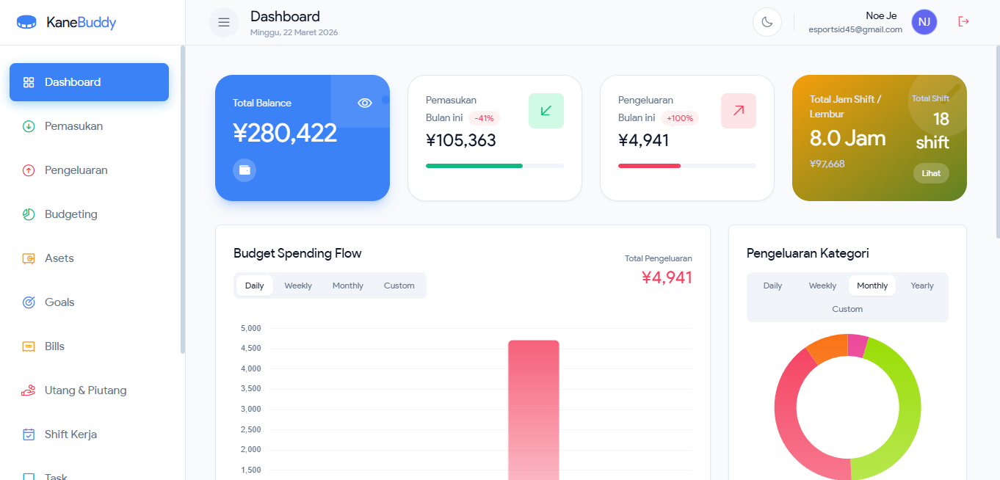

# 💸 KaneBuddy - Personal Wealth & Productivity Manager


**KaneBuddy** adalah aplikasi *All-in-One* yang menggabungkan pencatatan keuangan kelas profesional dengan manajemen produktivitas (tugas & waktu). Aplikasi ini dirancang dengan antarmuka UI/UX modern, mendukung *Dark/Light Mode*, dan memiliki fitur spesifik yang sangat membantu pekerja maupun ekspatriat (khususnya di Jepang).

---

## ✨ Fitur Utama (Core Features)

### 💰 1. Manajemen Arus Kas & Anggaran (Cashflow & Budgeting)
* **Smart Transactions:** Pencatatan Pemasukan dan Pengeluaran dengan kategori yang dapat dikustomisasi.
* **Budgeting Pro:** Atur batas pengeluaran bulanan per kategori. *Progress bar* akan otomatis terisi dan berubah warna menjadi merah jika anggaran hampir jebol.
* **Upcoming Bills:** Pengingat tagihan rutin otomatis agar tidak pernah telat membayar.

### 💎 2. Pemantau Kekayaan (Wealth Tracker)
* **Net Worth Calculator:** Menghitung total Kekayaan Bersih secara *real-time* berdasarkan aset yang dimiliki dikurangi beban utang.
* **Asset Management:** Lacak nilai tabungan, investasi, emas, kendaraan, dan properti.
* **Utang & Piutang:** Pisahkan catatan uang yang dipinjam dan dipinjamkan, lengkap dengan fitur cicilan pembayaran.
* **Financial Goals:** Pasang target impian (misal: Beli Laptop) dengan kalkulator pintar yang menyarankan nominal tabungan per bulan.

### 🚀 3. Produktivitas & Manajemen Waktu
* **Kanban Task Manager:** Kelola tugas dengan fitur *Drag-and-Drop* ala Trello (Pending, In Progress, Completed). Mendukung Tenggat Waktu (*Due Date*), Prioritas, dan Tag.
* **Pomodoro Timer:** *Stopwatch* bawaan untuk fokus kerja dan istirahat agar terhindar dari *burnout*.
* **Shift Work Tracker:** Kalender khusus untuk mencatat jadwal *shift* kerja, memisahkan jam normal & lembur, serta mengestimasi total gaji.

### 🇯🇵 4. Eksekutif Ekspatriat (Japan-Focused Tools)
* **Remittance Calculator:** Catat riwayat kirim uang ke kampung halaman lengkap dengan konversi otomatis dari JPY (Yen) ke IDR (Rupiah).
* **Nenkin Estimator:** Hitung estimasi pengembalian asuransi pensiun Jepang berdasarkan gaji dan masa kerja.
* **Document Expiry Alarm:** Pengingat visual untuk dokumen penting (Paspor, Visa, Zairyu Card) yang mendekati masa kedaluwarsa.

---

## 🛠️ Teknologi yang Digunakan (Tech Stack)

### Frontend
* **HTML5 & CSS3**
* **Tailwind CSS** (via CDN untuk *styling* super cepat & responsif)
* **Vanilla JavaScript** (ES6+)
* **Phosphor Icons** & **Chart.js** (Untuk visualisasi data)

### Backend & Database
* **Node.js** & **Express.js** (RESTful API)
* **MySQL** (Relational Database)
* **Arsitektur "Optimistic UI":** Frontend akan menyimpan dan merender data ke *Local Storage* dalam hitungan milidetik, sementara sinkronisasi ke server MySQL berjalan secara asinkron di latar belakang (*background*).

---

## 🚀 Cara Instalasi & Menjalankan Aplikasi (Local Setup)

Ikuti langkah-langkah berikut untuk menjalankan KaneBuddy di komputermu:

### 1. Persiapan Database (MySQL)
1.  Pastikan kamu sudah menginstal **XAMPP** atau server MySQL lokal lainnya.
2.  Buka phpMyAdmin (`http://localhost/phpmyadmin`).
3.  Buat database baru dengan nama: `budget_db`.
4.  Jalankan *query* SQL yang dibutuhkan untuk membuat tabel (`tasks`, `shifts`, `transactions`, `goals`, `bills`, `nenkin`, dll) atau *import* file `.sql` jika tersedia.

### 2. Konfigurasi Backend (Node.js)
1.  Buka terminal/command prompt, arahkan ke folder proyek.
2.  Instal *dependencies* yang dibutuhkan:
    ```bash
    npm install express cors mysql2
    ```
3.  Jalankan server backend:
    ```bash
    node server.js
    ```
    *(Server akan berjalan di `http://localhost:3000`)*

### 3. Menjalankan Frontend
1. Buka file `index.html` menggunakan browser.
2. Sangat disarankan untuk membukanya menggunakan ekstensi **Live Server** di VS Code agar aplikasi berjalan optimal.

---


## 🤝 Kontribusi (Contributing)
Proyek ini adalah proyek portofolio pribadi. Namun, jika kamu menemukan *bug* atau memiliki ide fitur baru, silakan buka *Issues* atau buat *Pull Request*.

## 📄 Lisensi
Dibuat dengan ❤️ oleh [nurmuhamad45](https://github.com/nurmuhamad45).
